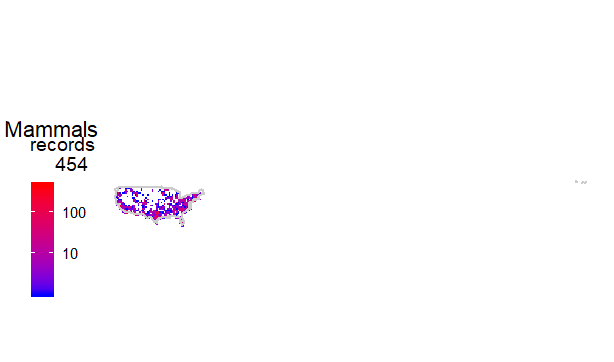
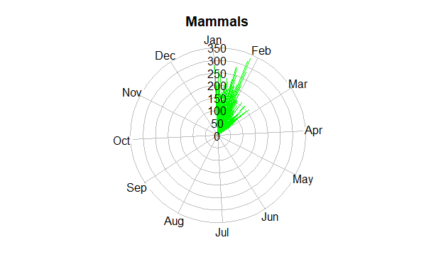
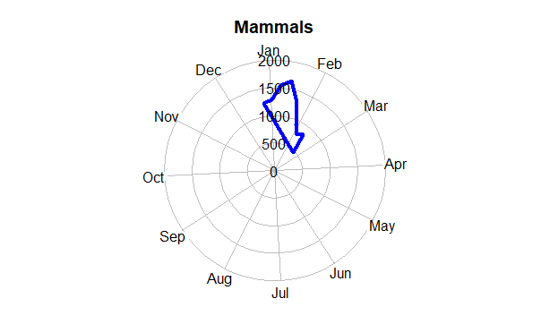
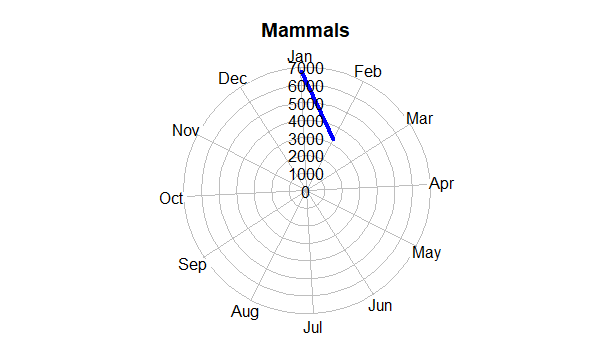
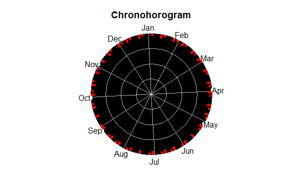

Enhancing-Visualizations-for-Biodiversity-Data_Test
================

Required packages
-----------------

The following packages are required to perform all the analyses.

``` r
# loading packages, if not installed and installing them.

pcakages <- c( "rgbif", "bdvis") # list of packages needed
req_packages <- pcakages[!(pcakages %in% installed.packages()[, "Package"])] # checking if the exist
if (length(req_packages) > 0) { # installing is needed
  install.packages(req_packages, dependencies = TRUE)
}
#Display
sapply(pcakages, require, character.only = TRUE)
```

Test Type: EASY
---------

Download 10,000 GBIF’s occurrence records of Mammals in the U.S (georeferenced records only), using the ‘rgbif’ R package.

``` r
#Downloading data from GBIF using rgbif
key <- name_backbone(name = "Mammalia")$usageKey
mammals <-occ_search(taxonKey = key,country = 'US', limit = 10000, hasCoordinate=TRUE, hasGeospatialIssue=FALSE, return = "data")

#Formating Downloaded Data
mammals <- format_bdvis(mammals,source='rgbif')

# Another Database that contain only perticular Column like Longitude and Latitude
mammals_g <- mammals[c("Longitude", "Latitude")]

```

Test Type: Medium
---------
Build few visualizations in R with ‘bdvis’ that most effectively summarize the Mammals data you downloaded. Extra points for high aesthetics and creativity.

**bdvis: Biodiversity Data Visualizations**

First We need to convert the data in bdvis format.

``` r
inat=format_bdvis(mammals_g,source='rgbif')
```

Now Let us generate Map.
``` r
mapgrid(indf = inat, ptype = "records", title = "Mammals", legscale = 0, collow = "blue", colhigh = "red",
        mapdatabase = "world", region = "US", gridscale = 1 )
```



For temporal visualization I used tempolar function. The data can be aggregated by day, week or month.

``` r
tempolar(inat, color="green", title="Mammals",
         plottype="r", timescale="d")
```


``` r
tempolar(inat, color="green", title="Mammals",
         plottype="r", timescale="d")
```



``` r
tempolar(inat, color="green", title="Mammals",
         plottype="r", timescale="d")
```


Chronohorogram:This plots number of records on each day with colors indicating the value and concentric circles for each year.

``` r
chronohorogram(mammals) 
```



